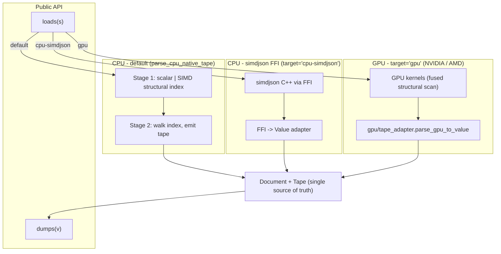
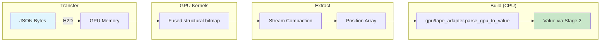

# Architecture

The library is built around a single in-memory representation: a
tape-backed `Document` plus a lightweight `Value` view. Every CPU
and GPU pipeline funnels into the same shape, so the rest of the
library (LazyValue, JSONPath, JSON Patch, schema validation,
reflection serde) operates on one model.

## Standards

| Standard | Where it lives | Catalog |
|---|---|---|
| RFC 8259 (JSON) | `cpu/stage1.mojo`, `cpu/stage2.mojo`, `cpu/number_parse.mojo`, `cpu/validate.mojo` | `tests/conformance/rfc8259.json` |
| RFC 7493 (I-JSON) | `ijson.mojo`, opt in with `ParserConfig.interoperable()` | `tests/conformance/rfc7493-ijson.json` |
| RFC 6901 (JSON Pointer) | `pointer.mojo`, used by `Value.at`, `patch.mojo` and `lazy.mojo` | `tests/conformance/rfc6901-pointer.json` |
| RFC 6902 (JSON Patch) | `patch.mojo` | `tests/conformance/rfc6902-patch.json` |
| RFC 7396 (JSON Merge Patch) | `patch.mojo` | `tests/conformance/rfc7396-merge-patch.json` |
| RFC 9535 (JSONPath) | `jsonpath.mojo` | the specification's own worked examples, in `tests/test_jsonpath.mojo` |
| RFC 9485 (I-Regexp) | `regex.mojo`, used by JSONPath `match`/`search` and schema `pattern` | `tests/test_regex.mojo` |
| JSON Schema draft 2020-12 | `schema.mojo` | `tests/conformance/jsonschema-2020-12.json` |

Each catalog has a runner that asserts the set of failing cases is
exactly a declared list of known gaps, so a regression fails the build
and so does fixing a gap without deleting its entry. Those lists are
currently empty.

## Licences

`json` is MIT throughout, but what it builds against is not.

| Component | Terms | Where to read them |
|---|---|---|
| `json` | MIT | `LICENSE` |
| Mojo toolchain | Source is Apache-2.0 with LLVM Exceptions; the conda packages still declare `LicenseRef-Modular-Proprietary` and ship the Modular Community License Terms | `info/licenses/LICENSE` in the installed package |
| simdjson | Apache-2.0, linked into `libsimdjson_wrapper.so` | `NOTICE` |
| MAX (`max-core`) | Modular Community License; GPU path only | `json/gpu/LICENSE-GPU.md` |

`json/gpu/` is the only part that needs `max-core`, and nothing on the
CPU import graph names it. That is load-bearing rather than tidy: Mojo
resolves every import statement it can see, whether or not the branch
holding it survives `comptime if`, and a module-scope `comptime if` is
rejected outright, so there is no way to write a conditional import. An
unimported submodule, by contrast, is never compiled. Keeping the GPU
entry point in `json/gpu/backend.mojo`, which `json/parser.mojo` does
not name, is therefore the only construction that keeps a default
install free of MAX. `pixi run verify-cpu-only` asserts it.

`json.gpu` therefore provides its own `loads` and `load`, with the same
`target` parameter as the ones in `json` and forwarding every non-GPU
target to them. The call site is unchanged, `loads[target="gpu"](...)`;
what changes is which module the name comes from, and that is what
keeps the import in the caller's hands.

## System Overview



`target='gpu'` runs natively on NVIDIA, AMD, and Apple Metal. All
three backends share the same lean pipeline: `fused_json_kernel`
emits the raw `{}[]:,` structural bitmap, stream compaction
extracts positions, and `gpu/tape_adapter.mojo` applies the
in-string filter on the CPU side using the same byte walk that
stage 2 needs. There is no GPU-side in-string mask and no CPU
bracket-matching pass -- the tape adapter consumes only
`gpu_result.structural`.

## CPU Backends

### Pure Mojo Backend (Default) -- two-pass parser

**Implementation:** Stage 1 builds a structural index of every byte
offset whose character is `{ } [ ] : , "` (outside string literals).
Stage 2 walks that index to produce a `Value` tree without re-scanning
bytes for structure.

**Location:**
- `json/cpu/stage1_scalar.mojo` -- byte-by-byte oracle (canonical;
  used for correctness validation of the SIMD path).
- `json/cpu/stage1.mojo` -- 32-byte SIMD scan via
  `memory.unsafe.pack_bits`.
- `json/cpu/stage2.mojo` -- index walker; emits `Value`. Strict
  validation for trailing commas, double commas, leading zeros,
  missing colons, missing values, unquoted keys, invalid escapes,
  and trailing top-level content.
- `json/cpu/__init__.parse_cpu_native_tape[force_scalar=False|True]`
  -- the public CPU entry point; emits a tape-backed `Value` view.
  Default is SIMD (~1.2x faster than the scalar walker on the
  benchmark corpora); pass `force_scalar=True` for differential
  testing against the scalar oracle.
- `tests/test_stage1_equivalence.mojo` -- asserts stage 1 SIMD and
  scalar produce byte-identical position lists, including a
  full-document run against the benchmark corpora.

**Performance (`pixi run -e dev bench-cpu`):**

Both benches use the same protocol: 3 warmup + 100 measured
iterations, min-time-derived throughput. The bench reports two
workloads per parser:

* `parse_only`: `loads(...)` + peek the root tag.
* `parse_traverse`: parse + recursively visit every leaf via
  the public `Value` API.

`parse_traverse` only adds a small constant on top of `parse_only`
on the Mojo side because every `Value` is a stable tape index, so
iteration is a tape walk and not a re-parse. The remaining gap to
native simdjson on `parse_only` is algorithmic (no Eisel-Lemire
float fast path, no AVX-512 64-byte chunks). Full breakdown in
[performance.md](./performance.md).

**Usage:**
```mojo
from json import loads
var data = loads('{"key": "value"}')  # default
```

### simdjson FFI Backend

**Implementation:** FFI wrapper around [simdjson](https://github.com/simdjson/simdjson)

**Location:**
- `json/cpu/simdjson_ffi/` -- C++ wrapper
- `json/cpu/simdjson_ffi.mojo` -- Mojo FFI bindings

**Performance:** ~0.48 GB/s on `twitter.json` -- the FFI marshalling is
the bottleneck here; if you want the simdjson algorithm without the
FFI tax, use the default Mojo simd path instead.

**Usage:**
```mojo
from json import loads
var data = loads[target="cpu-simdjson"]('{"key": "value"}')
```

### CPU Parsing Flow (simdjson)

1. Load JSON string into memory.
2. Call simdjson via FFI (`json/cpu/simdjson_ffi.mojo`).
3. Recursively build `Value` tree from the simdjson result.
4. Return parsed `Value`.

### CPU Parsing Flow (default, two-pass)

1. **Stage 1:** scan bytes once, emitting offsets of structural
   characters outside strings.
2. **Stage 2:** walk the structural index in O(structural_count),
   recursively constructing `Value` for objects, arrays, strings,
   numbers, and primitives. No byte-level re-scan.
3. Return parsed `Value`.

## GPU Backend

**Implementation:** Native Mojo GPU kernels inspired by [cuJSON](https://github.com/AutomataLab/cuJSON)

**Location:**
- `json/gpu/backend.mojo` - `loads` / `load` with the `target` parameter (opt-in; needs `max-core`)
- `json/gpu/parser.mojo` - Main GPU parser (`parse_json_gpu`, `parse_json_gpu_from_pinned`)
- `json/gpu/kernels.mojo` - CUDA-style GPU kernels (fused bitmap + structural extraction)
- `json/gpu/stream_compact.mojo` - GPU stream compaction for position extraction
- `json/gpu/bracket_match.mojo` - GPU parallel bracket matching (experimental; the main parse path uses a CPU stack matcher after stream compaction)

**Performance (804 MB `twitter_large_record.json`):**

| Platform | Throughput | Pipeline |
|---|---:|---|
| AMD MI355X | 13 GB/s | lean (single-shot) |
| NVIDIA B200 | ~6.5 GB/s | lean (single-shot, pinned wall-clock) |
| Apple M3 Pro | 3.1 GB/s | lean Metal (chunked) |

**Techniques:**
- One fused kernel emits the raw `{}[]:,` structural bitmap.
- Positions-only stream compaction (popcount + block prefix sum + scatter).
- CPU-side escape state machine in `gpu/tape_adapter.mojo` --
  the same byte walk that stage 2 already needs.

### GPU Pipeline



### GPU Parsing Flow

1. **Host-to-Device Transfer:** Copy JSON bytes to GPU using pinned memory (HostBuffer) for fast transfer (~15 ms for 804 MB).
2. **Fused GPU Kernel:** One kernel emits the raw `{}[]:,` structural bitmap (and the `{}[]` open-close bitmap, currently reserved for future use). The GPU does not build an in-string mask.
3. **Stream Compaction (GPU):** Extract only the positions of structural characters via popcount + block prefix sum + scatter (~95 ms on B200 at 804 MB).
4. **Device-to-Host Transfer:** Copy compact position array back to CPU.
5. **Tape Adapter (CPU):** `gpu/tape_adapter.parse_gpu_to_value` walks the byte stream once to apply the escape state machine, filtering structurals inside string literals, and runs **stage 2** to write tape entries into a `Document`.
6. **Value:** Returned as a tape-backed view (`Value(doc, tape_idx=0)`) over that `Document`; no extra DOM construction step.

### Why Hybrid GPU/CPU?

- **GPU excels at:** Parallel bitmap operations and stream compaction.
- **CPU excels at:** Byte-by-byte state machines (escape tracking) and tape construction with dynamic memory.
- **Key insight:** GPU stream compaction reduces D2H transfer size (from ~465 MB to a few MB on 804 MB input), and the CPU is fast enough to apply the escape state machine while consuming the compact position array.

## Value Type

The `Value` struct represents any JSON value (null, bool, int, float,
string, array, object). It carries one of two representations -- a
tape-backed view over a shared `Document`, or an owned mutable tree --
and which one it holds is an implementation detail; the whole API
behaves identically either way. A parsed value converts to the owned
tree the first time it is mutated, and at most once.

It behaves the way a JSON value behaves elsewhere:

- `len(v)` counts an array's elements, an object's members, or a
  string's bytes, and raises on a scalar rather than answering 0.
- `Bool(v)` is falsy for null, `false`, zero, and any empty string,
  array or object.
- `"key" in obj` and `3 in arr` test membership.
- `==` is a **structural deep comparison**: member order does not
  matter and `1 == 1.0`, because an object carries no order and JSON
  has one number type. `__hash__` agrees with it, so a `Value` can key
  a `Dict` and a reordered object finds the same bucket.
- `for item in arr:` and `obj.items()` / `keys()` / `values()` are
  lazy. `array_items()` / `object_items()` still build the whole
  `List` up front and are kept only for compatibility.
- Reading a scalar has three flavours by design: `int_value()` and
  friends never raise and never check the tag, `as_int()` and friends
  raise an error naming the type actually found, and `int_or(default)`
  and friends substitute a fallback.
- `get(key)` returns `Optional[Value]`, `get(key, default)` a value,
  `__setitem__` / `remove` / `pop` write and delete, negative indices
  count from the end, and `try_at(pointer)` is the non-raising twin of
  `at(pointer)`.

**Breaking change in 0.4.0:** `get(key)` used to return the member's
raw JSON *text* and raise on an absent key. That behaviour now lives
under the name that says what it does, `raw_member(key)`.

A nested write goes through a JSON Pointer. `doc["a"]` hands back an
independent value, so `doc["a"].set("b", v)` edits a detached child;
`doc.set_at("/a/b", v)` is the spelling that reaches `doc`.

See [API Reference](https://ehsanmok.github.io/json/) for complete `Value` methods.

## Directory Structure

```
json/
├── __init__.mojo              # Public API exports
├── prelude.mojo               # `from json.prelude import *` shortcut
├── parser.mojo                # Unified CPU/GPU dispatch, loads / load
├── serialize.mojo             # dumps / dump
├── document.mojo              # Tape-backed Document (single source of truth)
├── value/
│   ├── __init__.mojo         # Re-exports
│   ├── value.mojo            # Tape-backed Value view
│   ├── owned.mojo            # OwnedValue + _value_to_owned bridge
│   └── raw_ops.mojo          # String ops shared with LazyValue
├── types.mojo                 # JSONInput, JSONResult
├── iterator.mojo              # JSONIterator
├── ndjson.mojo                # NDJSON parsing / serialization
├── lazy.mojo                  # LazyValue (on-demand parsing of substrings)
├── streaming.mojo             # Streaming parser for huge files
├── config.mojo                # Parser / serializer configuration
├── errors.mojo                # Error formatting with line / column
├── unicode.mojo               # Unicode escape handling
├── pointer.mojo               # JSON Pointer (RFC 6901), shared by every layer
├── patch.mojo                 # JSON Patch & Merge Patch (RFC 6902 / 7396)
├── jsonpath.mojo              # JSONPath (RFC 9535)
├── gpu/                       # opt-in; needs max-core (see LICENSE-GPU.md)
├── regex.mojo                 # I-Regexp (RFC 9485), for schema and JSONPath
├── schema.mojo                # JSON Schema draft 2020-12
├── ijson.mojo                 # I-JSON (RFC 7493) checks
├── reflection.mojo            # Compile-time reflection serde
├── deserialize.mojo           # serialize_json / deserialize_json
├── cpu/
│   ├── __init__.mojo         # CPU dispatch entry points
│   ├── types.mojo            # Common JSON type constants
│   ├── stage1_scalar.mojo    # Byte-by-byte structural index oracle
│   ├── stage1.mojo           # SIMD structural index (pack_bits)
│   ├── stage2.mojo           # Index walker -> Document tape
│   ├── simdjson_ffi.mojo     # simdjson FFI bindings (target='cpu-simdjson')
│   └── simdjson_ffi/         # C++ simdjson wrapper (libsimdjson via conda)
└── gpu/
    ├── parser.mojo            # GPU parser entry points
    ├── kernels.mojo           # Fused structural-scan kernels
    ├── stream_compact.mojo    # GPU stream compaction
    ├── bracket_match.mojo     # GPU parallel bracket match (experimental)
    └── tape_adapter.mojo      # GPU positions -> stage 2 -> Document

tests/
├── test_api.mojo                   # Unified API (loads / dumps / load / dump)
├── test_value.mojo                 # Tape-backed Value semantics
├── test_value_mutation.mojo        # COW mutation propagation
├── test_document.mojo              # Document / tape construction
├── test_parser.mojo                # CPU parser (loads dispatch)
├── test_stage1_equivalence.mojo    # Stage 1 SIMD == scalar oracle
├── test_stage2_tape.mojo           # Stage 2 tape-emission unit tests
├── test_backend_equivalence.mojo   # CPU native parser == simdjson FFI
├── test_serialize.mojo             # Serialization
├── test_serde.mojo                 # Manual Serializable / Deserializable traits
├── test_reflection.mojo            # Compile-time reflection serde
├── test_patch.mojo                 # JSON Patch / Merge Patch
├── test_jsonpath.mojo              # JSONPath (RFC 9535)
├── test_regex.mojo                 # I-Regexp (RFC 9485)
├── test_schema.mojo                # JSON Schema draft 2020-12
├── test_conformance.mojo           # RFC 8259 and RFC 7493 catalogs
├── test_pointer_patch_conformance.mojo  # RFC 6901 / 6902 / 7396 catalogs
├── test_schema_conformance.mojo    # JSON Schema 2020-12 catalog
├── test_e2e.mojo                   # End-to-end
├── test_gpu.mojo                   # GPU parser
├── test_gpu_kernels.mojo           # GPU kernel correctness (stream compaction)
├── test_bracket_match.mojo         # GPU bracket-match
└── bench_bracket_match.mojo        # GPU bracket-match microbenchmark

benchmark/
├── datasets/                       # Benchmark files
├── mojo/
│   ├── bench_cpu.mojo             # CPU bench: parse_only + parse_traverse
│   ├── bench_backend.mojo         # Cross-backend comparison harness
│   └── bench_gpu.mojo             # GPU bench
├── cpp/
│   └── bench_simdjson.cpp         # Native simdjson C++ reference bench
└── cuJSON/                         # Optional cuJSON checkout (cloned manually;
                                    # see benchmark/README.md) for head-to-head
```

## Build & Test

```bash
# Build simdjson FFI wrapper
pixi run build

# Run tests
pixi run tests-cpu  # CPU parser tests
pixi run tests-gpu  # GPU parser tests

# Benchmarks
pixi run bench-cpu   # CPU: json vs simdjson
pixi run bench-gpu   # GPU: json only
pixi run bench-gpu-cujson  # GPU: json vs cuJSON
```

## Dependencies

- **Mojo:** Latest nightly (with GPU support), pulled in automatically by `pixi install`
- **simdjson:** Installed from conda-forge (`simdjson >=4.2.4,<5`). The thin
  C++ FFI wrapper in `json/cpu/simdjson_ffi/` is auto-built by `pixi install`
  via the activation hook.
- **sysroot_linux-64:** `>=2.34` (Linux only) so `mojo build` can link
  against glibc 2.34 symbols referenced by Mojo's runtime libs.
- **cuJSON:** Optional; clone manually into `benchmark/cuJSON` for the
  head-to-head GPU benchmark. See `benchmark/README.md`.
- **CUDA:** Required for the GPU backend (any SM70+ NVIDIA GPU works;
  the library has also been tested on AMD ROCm and Apple Silicon).
